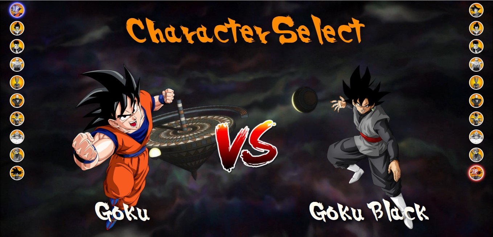

<h1 align="center">Dragon-Ball</h1>
<h3 align="center">Menu de jogo para Dragon Ball</h3>

## 🥊 Sobre:
Esse é um projeto foi inspirado no desenho Dragon Ball, a estrutura dele foi baseada no projeto MapaDevWeek.

## Link
- Solução: [Ir para solução](https://carlosalischutz.github.io/Dragon-Ball2.0/)

## 🛠 Tecnologias

